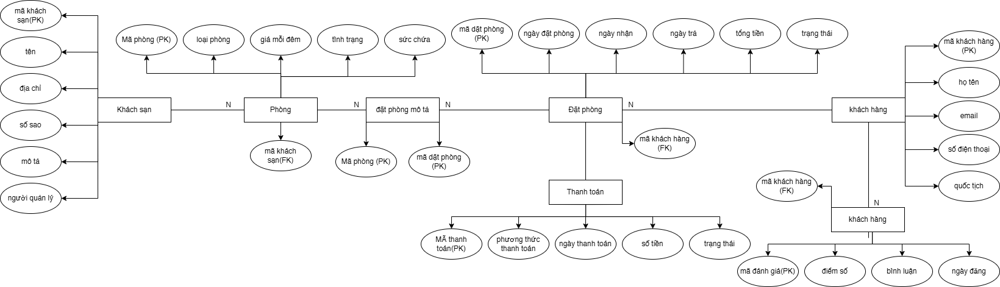

1. Xác định các thực thể và thuộc tính chính
- Khách sạn (Hotel)
    - Khóa chính (PK): mã khách sạn
    - Thuộc tính:
        - tên
        - địa chỉ
        - số sao
        - mô tả
        - người quản lý

- Phòng (Room)
    - Khóa chính (PK): mã phòng
    - Thuộc tính:
        - loại phòng
        - giá mỗi đêm
        - tình trạng
        - sức chứa

- Khách hàng (Customer)
    - Khóa chính (PK): mã khách hàng
    - Thuộc tính:
        - họ tên
        - email
        - số điện thoại
        - quốc tịch

- Đặt phòng (Booking)
    - Khóa chính (PK): mã đặt phòng
    - Thuộc tính:
        - ngày đặt
        - ngày nhận
        - ngày trả
        - tổng tiền
        - trạng thái

- Thanh toán (Payment)
    - Khóa chính (PK): mã thanh toán
    - Thuộc tính:
        - phương thức
        - ngày thanh toán
        - số tiền
        - trạng thái

- Đánh giá (Review)
    - Khóa chính (PK): mã đánh giá
    - Thuộc tính:
        - điểm số
        - bình luận
        - ngày đăng

2. Xác định mối quan hệ giữa các thực thể
- Hotel - Room (1-N)
- Customer - Booking (1-N)
- Booking - Room (N-N) thông qua một bảng liên kết (BookingRoom)
- Booking - Payment (1-1)
- Customer - Review (1-N)
- Review - Hotel (N-1)

3. Vẽ sơ đồ ERD mô tả đầy đủ các mối quan hệ và ràng buộc

4. Chỉ rõ khóa chính, khóa ngoại, và thuộc tính đa trị (nếu có)
- Hotel
    - Khóa chính: mã khách sạn
    - Khóa ngoại: không có
    - Thuộc tính đa trị: không có
- Room
    - Khóa chính: mã phòng
    - Khóa ngoại: mã khách sạn
    - Thuộc tính đa trị: không có
- Customer
    - Khóa chính: mã khách hàng
    - Khóa ngoại: không có
    - Thuộc tính đa trị: không có
- Booking
    - Khóa chính: mã đặt phòng
    - Khóa ngoại: mã khách hàng
    - Thuộc tính đa trị: không có
- BookingRoom (bảng liên kết N-N)
    - Khóa chính: (mã đặt phòng, mã phòng)
    - Khóa ngoại: mã đặt phòng -> Booking, mã phòng -> Room
    - Thuộc tính đa trị: không có
- Payment
    - Khóa chính: mã thanh toán
    - Khóa ngoại: mã đặt phòng (một-1 với Booking)
    - Thuộc tính đa trị: không có
- Review
    - Khóa chính: mã đánh giá
    - Khóa ngoại: mã khách hàng, mã khách sạn
    - Thuộc tính đa trị: không có