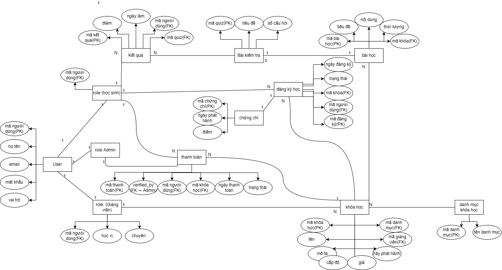

1. Xác định các thực thể và thuộc tính chính
- Người dùng (User)
    - Khóa chính (PK): mã người dùng
    - Thuộc tính:
        - họ tên
        - email
        - mật khẩu
        - vai trò (student/instructor/admin)

- Khóa học (Course)
    - Khóa chính (PK): mã khóa
    - Thuộc tính:
        - tên
        - mô tả
        - cấp độ
        - giá
        - ngày phát hành
        - mã danh mục (FK)
        - mã giảng viên (FK)

- Danh mục khóa học (Category)
    - Khóa chính (PK): mã danh mục
    - Thuộc tính:
        - tên danh mục

- Giảng viên (Instructor) - subtype của User (ISA)
    - Khóa chính (PK): mã người dùng (FK -> User)
    - Thuộc tính:
        - học vị
        - chuyên môn

- Đăng ký học (Enrollment)
    - Khóa chính (PK): mã đăng ký
    - Thuộc tính:
        - mã người dùng (FK)
        - mã khóa (FK)
        - ngày đăng ký
        - trạng thái (đang học, hoàn thành, hủy)

- Bài học (Lesson)
    - Khóa chính (PK): mã bài học
    - Thuộc tính:
        - tiêu đề
        - nội dung
        - thời lượng
        - mã khóa (FK)

- Bài kiểm tra (Quiz)
    - Khóa chính (PK): mã quiz
    - Thuộc tính:
        - tiêu đề
        - số câu hỏi
        - mã bài học (FK)

- Kết quả (Result)
    - Khóa chính (PK): mã kết quả
    - Thuộc tính:
        - điểm
        - ngày làm
        - mã người dùng (FK)
        - mã quiz (FK)

2. Xác định mối quan hệ giữa các thực thể
- User - Instructor (1-1)
- User - Enrollment (1-N)
- User - Result (1-N)
- Course - Instructor (N-1)
- Course - Category (N-1)
- Course - Lesson ( 1-(0..N) )
- Course - Enrollment (1-N)
- Lesson - Quiz (1-N)
- Quiz - Result (1-N)
- User – Course = N–N (thông qua Enrollment)

3. Vẽ sơ đồ ERD mô tả đầy đủ các mối quan hệ và ràng buộc

4. Chỉ rõ khóa chính, khóa ngoại, và thuộc tính đa trị (nếu có)
- User
    - Khóa chính: mã người dùng
    - Khóa ngoại: không có
    - Thuộc tính đa trị: không có
- Instructor
    - Khóa chính: mã người dùng (FK -> User)
    - Khóa ngoại: mã người dùng (FK -> User)
    - Thuộc tính đa trị: không có
- Category
    - Khóa chính: mã danh mục
    - Khóa ngoại: không có
    - Thuộc tính đa trị: không có
- Course
    - Khóa chính: mã khóa
    - Khóa ngoại: mã danh mục, mã giảng viên (FK -> Instructor)
    - Thuộc tính đa trị: không có
- Enrollment
    - Khóa chính: mã đăng ký
    - Khóa ngoại: mã người dùng (FK -> User), mã khóa (FK -> Course)
    - Thuộc tính đa trị: không có
- Lesson
    - Khóa chính: mã bài học
    - Khóa ngoại: mã khóa (FK -> Course)
    - Thuộc tính đa trị: không có
- Quiz
    - Khóa chính: mã quiz
    - Khóa ngoại: mã bài học (FK -> Lesson)
    - Thuộc tính đa trị: không có
- Result
    - Khóa chính: mã kết quả
    - Khóa ngoại: mã người dùng (FK -> User), mã quiz (FK -> Quiz)
    - Thuộc tính đa trị: không có

(Optional): Đề xuất thêm bảng Payment hoặc Certificate để mở rộng hệ thống
- Payment: mã thanh toán, mã người dùng (FK), mã khóa (FK), số tiền, ngày thanh toán, phương thức
- Certificate: mã chứng chỉ, mã người dùng (FK), mã khóa (FK), ngày cấp, điểm trung bình