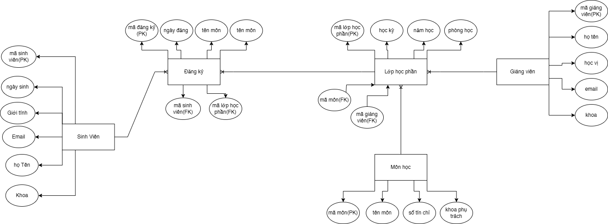

1. Xác định các thực thể và thuộc tính chính
- Student (Sinh viên)
    - Khóa chính (PK): mã sinh viên
    - Thuộc tính:
        - họ tên
        - ngày sinh
        - giới tính
        - email
        - khoa

- Course (Môn học)
    - Khóa chính (PK): mã môn
    - Thuộc tính:
        - tên môn
        - số tín chỉ
        - khoa phụ trách 

- Instructor (Giảng viên)
    - Khóa chính (PK): mã giảng viên
    - Thuộc tính:
        - họ tên
        - học vị
        - email
        - khoa

- Class_Section (Lớp học phần)
    - Khóa chính (PK): mã lớp học phần
    - Thuộc tính:
        - học kỳ
        - năm học
        - phòng học
        - mã môn(FK)
        - mã giảng viên(FK)

- Enrollment (Đăng ký)
    - Khóa chính (PK): mã đăng ký
    - Thuộc tính:
        - mã sinh viên(FK)
        - mã lớp học phần(FK)
        - ngày đăng ký
        - trạng thái

2. Xác định mối quan hệ giữa các thực thể
- Student – Enrollment (1:N)
- Class_Section – Enrollment (1:N)
- Course – Class_Section (1:N)
- Instructor – Class_Section (1:N)
- Quan hệ gián tiếp giữa Student và Course thông qua Enrollment và Class_Section

3. Vẽ sơ đồ ERD mô tả đầy đủ các mối quan hệ và ràng buộc

4. Chỉ rõ khóa chính, khóa ngoại, và thuộc tính đa trị (nếu có)
- Student
    - Khóa chính: mã sinh viên
    - Khóa ngoại: không có
    - Thuộc tính đa trị: không có
- Course
    - Khóa chính: mã môn
    - Khóa ngoại: không có
    - Thuộc tính đa trị: không có
- Instructor
    - Khóa chính: mã giảng viên
    - Khóa ngoại: không có
    - Thuộc tính đa trị: không có
- Class_Section
    - Khóa chính: mã lớp học phần
    - Khóa ngoại: mã môn, mã giảng viên
    - Thuộc tính đa trị: không có
- Enrollment
    - Khóa chính: mã đăng ký
    - Khóa ngoại: mã sinh viên, mã lớp học phần
    - Thuộc tính đa trị: không có