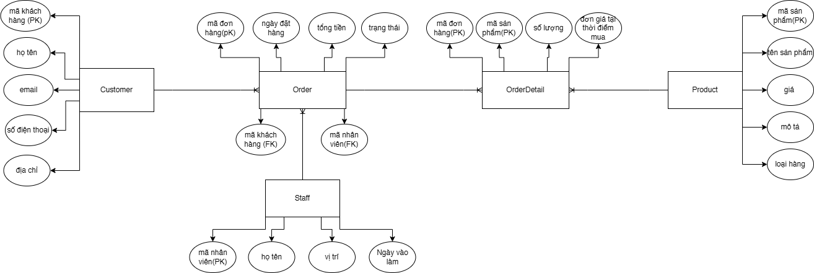

1. Xác định các thực thể và thuộc tính chính
- Khách hàng (Customer)
    - Khóa chính (PK): mã khách hàng
    - Thuộc tính:
        - họ tên
        - email
        - số điện thoại
        - địa chỉ

- Sản phẩm (Product)
    - Khóa chính (PK): mã sản phẩm
    - Thuộc tính:
        - tên sản phẩm
        - giá
        - mô tả
        - loại hàng

- Đơn hàng (Order)
    - Khóa chính (PK): mã đơn
    - Thuộc tính:
        - ngày đặt hàng
        - tổng tiền
        - trạng thái

- Chi tiết đơn hàng (OrderDetail)
    - Khóa chính (PK): (OrderID, ProductID)
    - Khóa ngoại (FK):
        - OrderID -> Order
        - ProductID -> Product
    - Thuộc tính:
        - ProductID
        - số lượng
        - đơn giá tại thời điểm mua

- Nhân viên (Staff)
    - Khóa chính (PK): mã nhân viên
    - Thuộc tính:
        - họ tên
        - vị trí
        - ngày vào làm
2. Xác định mối quan hệ giữa các thực thể
- Customer - Order (1-N)
- Staff - Order (1-N)
- Order - OrderDetail (1-N)
- Product - OrderDetail (1-N)
- Order - Product (N-N) thông qua OrderDetail
3. Vẽ sơ đồ ERD thể hiện các thực thể, mối quan hệ, và ràng buộc (1–n, n–n)

4. Ghi chú khóa chính (PK), khóa ngoại (FK) rõ ràng trong sơ đồ
- Customer
    - Khóa chính: mã khách hàng
    - Khóa ngoại: không có
    - Thuộc tính đa trị: không có

- Staff
    - Khóa chính: mã nhân viên
    - Khóa ngoại: không có
    - Thuộc tính đa trị: không có

- Product
    - Khóa chính: mã sản phẩm
    - Khóa ngoại: không có
    - Thuộc tính đa trị: không có

- Order
    - Khóa chính: mã đơn hàng
    - Khóa ngoại: mã khách hàng, mã nhân viên
    - Thuộc tính đa trị: không có

- OrderDetail
    - Khóa chính: mã đơn hàng, mã sản phẩm
    - Khóa ngoại: mã đơn hàng, mã sản phẩm
    - Thuộc tính đa trị: không có
